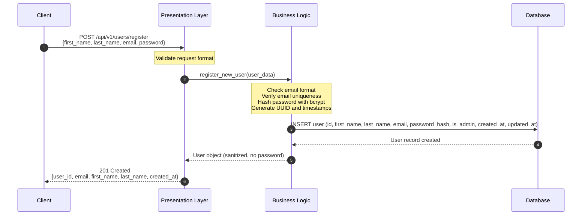
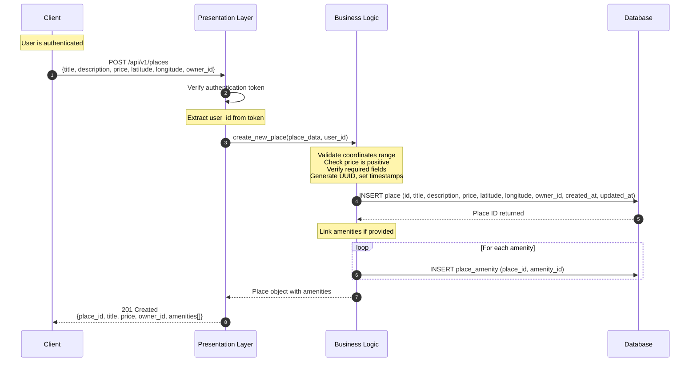
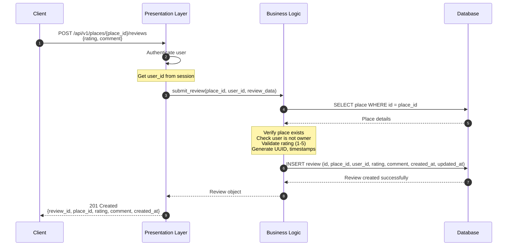
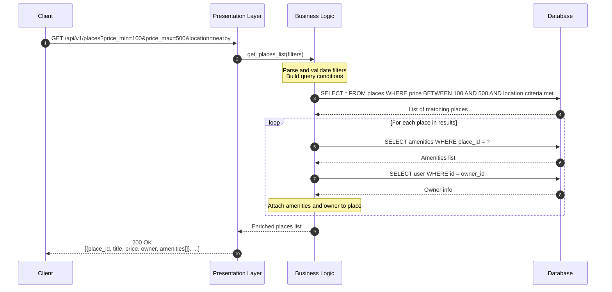

# 2. Sequence Diagrams for API Calls

This document presents sequence diagrams for four essential API operations in the HBnB Evolution application, showing how requests flow through the system layers.

---

## 1. User Registration

**Overview**: Creates a new user account by validating the provided information and securely storing it in the database.

---

## 2. Place Creation

**Overview**: Enables authenticated users to list a new property with details and location information.

---

## 3. Review Submission

**Overview**: Allows users to submit ratings and feedback for places they have experienced.

---

## 4. Fetching a List of Places

**Overview**: Retrieves places based on search criteria, including associated amenities and owner information.

---

## Summary

These diagrams demonstrate the interaction patterns for core HBnB operations:

- **User Registration**: Focuses on data validation and secure password storage
- **Place Creation**: Shows authentication flow and relationship building with amenities
- **Review Submission**: Enforces business rules preventing owners from reviewing their properties
- **Fetching Places**: Demonstrates query filtering and data aggregation from multiple tables

Each operation follows the layered architecture with clear separation between presentation, business logic, and data persistence concerns.
