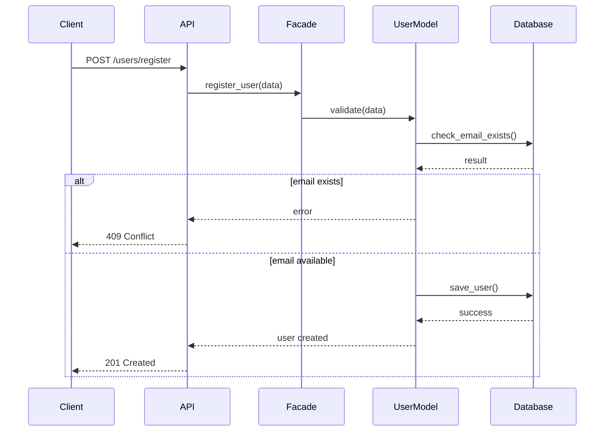
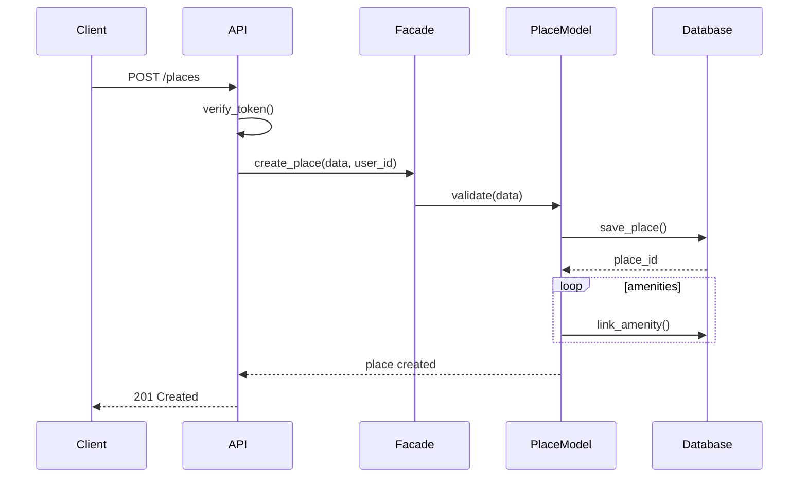
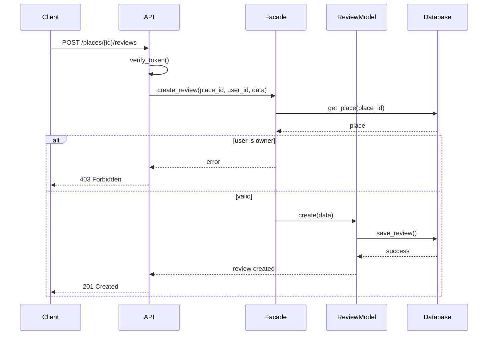
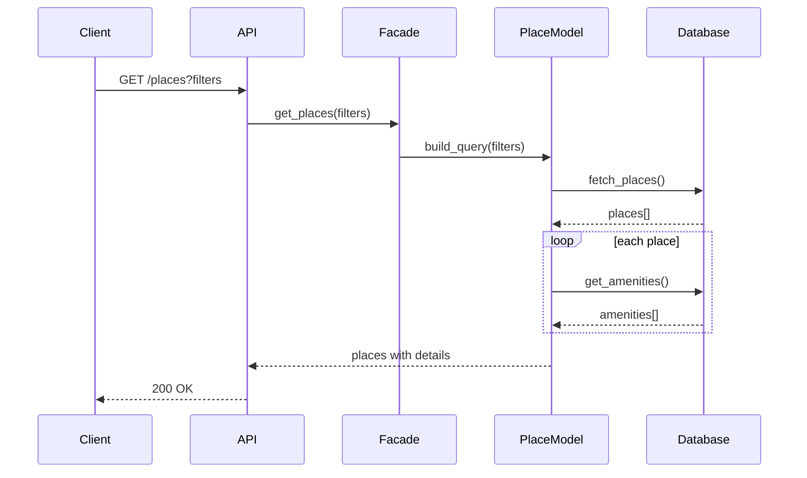

# 2. Sequence Diagrams for API Calls

This document shows the interaction flow for four main API operations in HBnB Evolution.

---

## 1. User Registration

When a user signs up, the system validates their information and creates a new account.

---

## 2. Place Creation

Authenticated users can create place listings with amenities.

---

## 3. Review Submission

Users can submit reviews for places they've visited.

---

## 4. Fetching Places

Retrieve a list of places with optional filters.

---

## Notes

- All diagrams follow the 3-layer architecture pattern
- Authentication is handled at the API layer
- Business logic validation occurs in the Facade/Model layer
- Database operations are isolated in the Persistence layer
