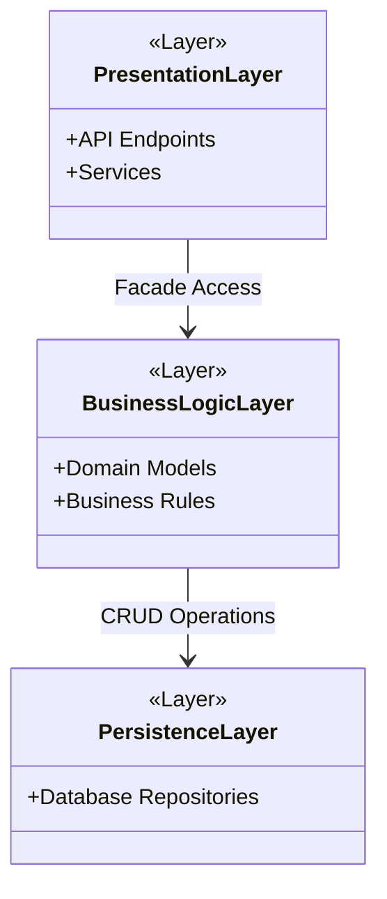
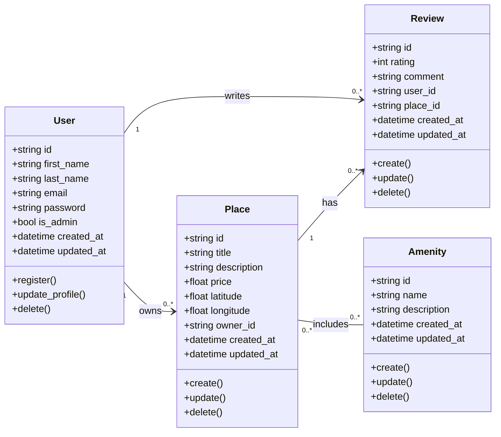
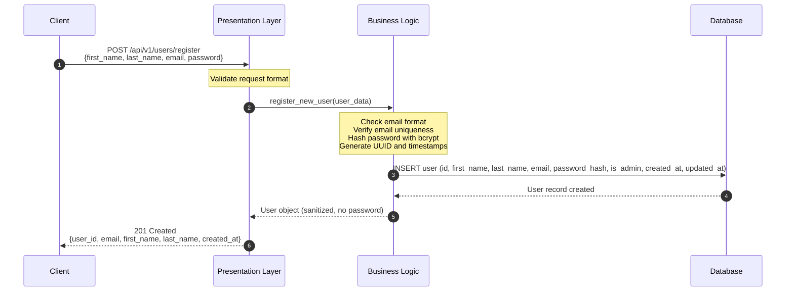
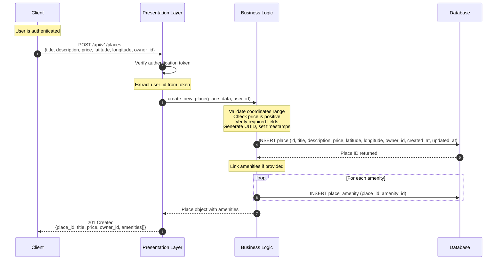
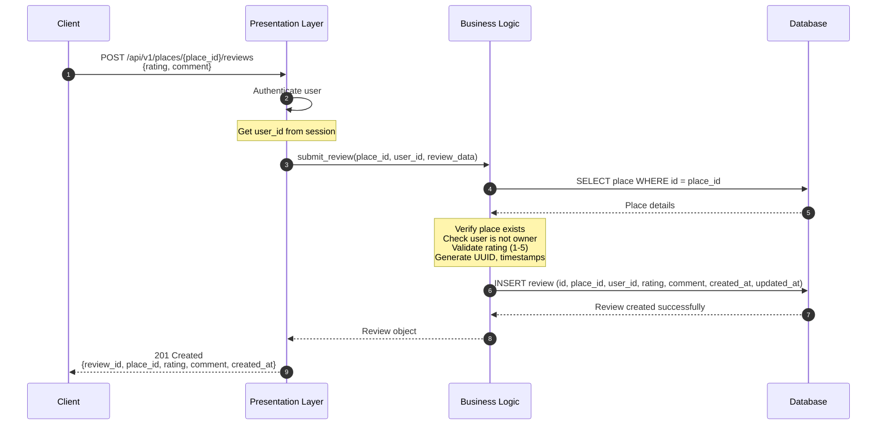
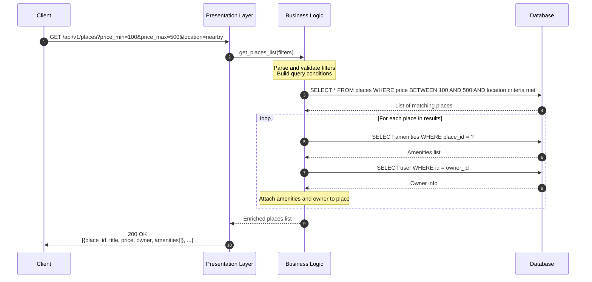

# HBnB Evolution – Technical Documentation (Part 1)

## 1) Introduction
This document is a detailed technical blueprint for the **HBnB Evolution** application (a simplified AirBnB-like system).  
It explains **how the system is designed** before implementation, focusing on:

- **System Architecture** (how the application is structured into layers)
- **Business Logic Model** (core entities and their relationships)
- **API Interaction Flows** (how requests move through the system)

### 1.1 Scope of the System
The application supports four main features:

1. **User Management**
   - Register users
   - Update user profile
   - Delete users
   - Distinguish admin users using a boolean flag

2. **Place Management**
   - Users can create and manage property listings (places)
   - Each place includes: title, description, price, latitude, longitude
   - Each place belongs to an owner (a user)
   - A place can have a list of amenities

3. **Review Management**
   - Users can write reviews for places
   - A review includes: rating and comment
   - Reviews relate to both a user and a place

4. **Amenity Management**
   - Create and manage amenities (e.g., WiFi, Parking)
   - Amenities can be associated with places

### 1.2 Global Rules
Across all entities:
- Each object must have a **unique id**
- Each object must store:
  - `created_at` (when it was created)
  - `updated_at` (when it was last updated)

---

## 2) System Architecture Overview (Layered Architecture + Facade)

### 2.1 Why a Layered Architecture?
Layered architecture makes large systems easier to build and maintain by separating responsibilities:

- If you change the database, you should not rewrite your API.
- If you change business rules, you should not rewrite database code.
- Each layer has one job and avoids mixing concerns.

### 2.2 What Each Layer Does
**Presentation Layer**
- Receives requests from clients (browser/app)
- Validates request format (required fields, types)
- Calls the business layer to execute actions
- Returns HTTP responses

**Business Logic Layer**
- Holds the core rules of the system
- Validates business rules (e.g., rating range, ownership rules, unique email)
- Builds domain objects (User, Place, Review, Amenity)
- Decides what should be saved/updated

**Persistence Layer**
- Saves and retrieves data
- Acts like a “storage service” (DB queries / repository layer)
- Keeps database details separate from business logic

### 2.3 Facade Pattern (Why it Matters Here)
The Facade pattern provides a **single entry point** to the business logic.  
Instead of the Presentation layer directly calling many services/models, it calls the Facade which coordinates everything internally.

Benefits:
- Reduces coupling between API and internal logic
- Makes the system easier to extend (new operations can be added behind the facade)
- Keeps presentation code clean

### 2.4 High-Level Package Diagram

### 2.5 How to Read This Diagram
- The boxes represent **packages/layers**, not individual classes.
- The arrows represent **allowed direction of communication**:
  - Presentation calls Business Logic through a Facade interface.
  - Business Logic performs CRUD by using the Persistence layer.
- The main idea: **each layer depends only on the next layer below it**.

---

## 3) Business Logic – Core Domain Model (Class Diagram)

### 3.1 What This Diagram Represents
This class diagram defines the main **entities** (models) used inside the Business Logic layer.  
It shows:
- Attributes (data fields)
- Methods (expected operations)
- Relationships (how objects connect)
- Multiplicity (how many objects can relate to each other)

### 3.2 Entities (Meaning)
**User**
- Represents a person using the platform
- Has identity fields (name, email) and security (password)
- Can be admin or regular user
- Can own places and write reviews

**Place**
- Represents a listed property
- Has price and location coordinates
- Has one owner (a user)
- Can have reviews and amenities

**Review**
- Represents feedback from a user about a place
- Contains a numeric rating and a text comment
- Belongs to one user and one place

**Amenity**
- Represents a feature/service (WiFi, AC, Parking)
- Can be associated with many places

### 3.3 Detailed Class Diagram

### 3.4 How to Read the Relationships (Very Important)
- `User "1" --> "0..*" Place : owns`
  - One user can own **zero or many** places.
  - Each place has exactly **one** owner.

- `User "1" --> "0..*" Review : writes`
  - One user can write **many** reviews.

- `Place "1" --> "0..*" Review : has`
  - One place can have **many** reviews.

- `Place "0..*" -- "0..*" Amenity : includes`
  - Many-to-many relationship:
    - A place can include many amenities
    - An amenity can be used by many places

### 3.5 Why We Include created_at / updated_at
These timestamps help:
- auditing (tracking changes)
- debugging (when something was created/updated)
- synchronization in future components

---

## 4) API Interaction Flows (Sequence Diagrams)

### 4.1 What Sequence Diagrams Show
A sequence diagram explains:
- Who starts the request (Client)
- Which layer receives it (Presentation)
- How logic is applied (Business Logic)
- Where data is stored/retrieved (Database)

In each diagram:
- Arrows `->>` show calls/messages
- `Note over` indicates validation or important steps
- Responses `-->>` show returned results

---

## 4.2 User Registration

### Goal
Create a new user account safely and correctly.

### Key Rules
- Email must be valid format
- Email must be unique
- Password should be stored securely (hashing)
- System assigns `id`, `created_at`, `updated_at`

### Explanation (Step-by-step)
1. Client sends registration data to the API.
2. Presentation validates request shape (missing fields, invalid types).
3. Business Logic applies core rules:
   - unique email
   - hashed password
   - timestamps + id
4. Database stores the user record.
5. Response returns a **sanitized** user (never return password).

---

## 4.3 Place Creation

### Goal
Allow a logged-in user to create a new place listing.

### Key Rules
- User must be authenticated (token/session)
- Price must be positive
- Latitude/longitude must be valid ranges
- Place gets id + timestamps
- Amenities may be linked (many-to-many)

### Explanation (Step-by-step)
1. Client sends place data.
2. Presentation verifies authentication and extracts the real user_id.
3. Business Logic validates all constraints and generates IDs/timestamps.
4. Database inserts the place.
5. If amenities exist, inserts into join table (`place_amenity`).
6. Response returns created place data.

---

## 4.4 Review Submission

### Goal
Let a user submit a rating and comment for a place.

### Key Rules
- Place must exist
- Rating must be within range (1–5)
- Review gets id + timestamps

### Explanation (Step-by-step)
1. Client posts a review to the place endpoint.
2. Presentation authenticates and provides user_id.
3. Business Logic ensures the place exists and rating is valid.
4. Database inserts the review record.
5. Response returns the created review.

---

## 4.5 Fetching a List of Places

### Goal
Return a list of places matching filters, enriched with related information.

### Key Rules
- Filters must be validated (numbers, ranges)
- Query returns matching rows
- For each place, amenities and owner may be fetched and attached

### Explanation (Step-by-step)
1. Client requests places with query filters.
2. Business Logic validates filters and builds the query.
3. Database returns list of places.
4. For each place, the system fetches amenities and owner info.
5. Response returns an enriched list suitable for the client UI.

---

## 5) Conclusion
This document describes the HBnB Evolution design in a clear and structured way.  
It defines:
- How the system layers communicate
- The domain entities and relationships
- The request flows for critical API operations

This is intended to guide later implementation phases and ensure the architecture remains consistent.

